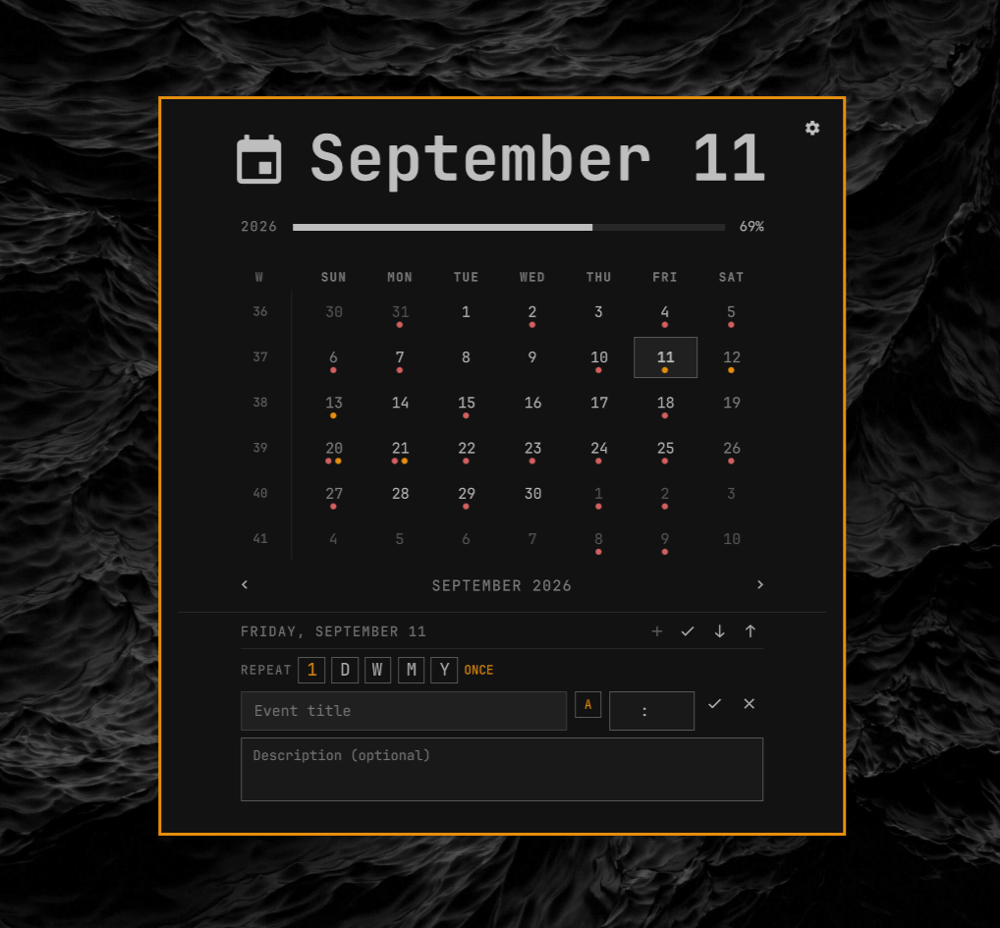
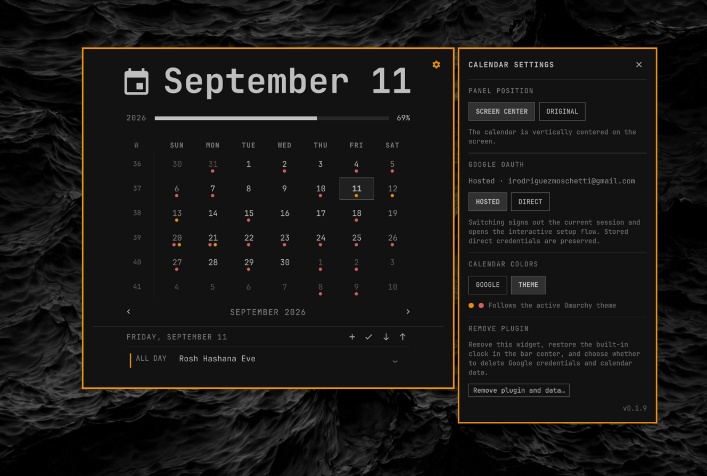

# Omarchy Google Calendar and Clock

An Omarchy bar clock with a local-first calendar. It reads standard `.ics`
files through [Caldir](https://github.com/t4t5/caldir), supports local event
creation and editing, and can pull from or push to Google Calendar on demand.

Calendar data and OAuth credentials stay in Caldir's local directories. The
plugin stores only an owner-readable derived event cache and includes no
telemetry.





## Requirements

- Omarchy with the Quattro plugin API
- An x86-64 or ARM64 Linux system
- A Google account for Google sync

The plugin downloads its own patched Caldir runtime; no Rust toolchain or
separate Caldir installation is required.

Each release includes one committed SHA-256 digest per architecture. Setup
verifies the downloaded archive against the digest in the installed plugin
checkout before extracting or executing it.

## Install and set up

Add and enable the plugin with Omarchy:

```bash
omarchy plugin add https://github.com/NachoRodriguezM/omarchy-google-calendar-clock --enable
```

It initially behaves as a plain clock. Click it to open the calendar, then
select **Direct setup** or **Hosted setup**. The selected flow opens in a
terminal and guides you through the remaining steps.

You can run the same setup from a terminal:

```bash
~/.config/omarchy/plugins/omarchy-google-calendar-clock/setup          # Direct
~/.config/omarchy/plugins/omarchy-google-calendar-clock/setup --hosted # Hosted
```

After setup verifies the release, Google connection, and first calendar pull,
it disables the built-in clock, enables this widget, and anchors it at the
exact center of the bar.

### Choose an OAuth mode

**Direct (default, recommended).** You create a Desktop OAuth client in your
own Google Cloud project. Authentication and token refreshes go directly
between your machine and Google.

**Hosted.** Caldir.org provides the OAuth relay, so no Google Cloud project is
needed. The trade-off is that sign-in and future token refreshes depend on
caldir.org, and OAuth tokens pass through its servers.

The setup flow explains the same choice before it proceeds. An existing OAuth
session is reused; it is not recreated on every setup run.

### Switch modes later

```bash
~/.config/omarchy/plugins/omarchy-google-calendar-clock/scripts/calendar-auth-mode switch hosted
~/.config/omarchy/plugins/omarchy-google-calendar-clock/scripts/calendar-auth-mode switch direct
```

Switching signs out the current session and starts the chosen sign-in flow.
Your direct OAuth client ID and secret are kept when switching modes. Check the
current mode with:

```bash
~/.config/omarchy/plugins/omarchy-google-calendar-clock/scripts/calendar-auth-mode status --json
```
You can see the chosen mode and switch from the settings panel too.

## Use

Click the clock to open the calendar. The toolbar lets you:

- create an event (`+`);
- preview local and remote differences (`✓`);
- pull from Google (`↓`);
- push local changes after confirmation (`↑`).

The settings button can switch OAuth mode, choose Google or theme calendar
colors, and open the interactive full-uninstall flow.

The plugin reads its local cache immediately, refreshes in the background at
shell startup, and pulls every 30 minutes. Automatic refresh never pushes your
local changes. The cache is stored at
`~/.local/state/omarchy/calendar-cache.json` with owner-only permissions.

## Clock formats

The clock label has three customizable format slots. Right-click the clock to
cycle them in order (1 → 2 → 3 → 1); the active slot survives restarts.
Horizontal and vertical bars have independent slot values. Settings live in
the plugin's entry in shell.json.

| Setting | Meaning |
|---|---|
| `format1` / `format2` / `format3` | Horizontal slots 1–3 |
| `verticalFormat1` … `verticalFormat3` | Vertical slots 1–3 |
| `activeFormatSlot` | Active slot (1–3, default 1); shared between orientations |
| `locale` | Language for month/weekday names: `system` (default, follows the system locale) or a Qt/BCP-47 locale name such as `zh_TW` or `en_US`. An invalid value falls back to the system locale. |

For example, the plugin's entry in shell.json could look like this:

```json
{
  "id": "omarchy-google-calendar-clock",
  "locale": "system",
  "format1": "dddd HH:mm",
  "format2": "M月d日 dddd HH:mm",
  "format3": "%Y年%m月%d日 %A %H:%M",
  "activeFormatSlot": 1
}
```

Unset slots fall back to these defaults:

| Slot | Horizontal | Vertical |
|---|---|---|
| 1 | `dddd HH:mm` | `HH\n—\nmm` |
| 2 | `M月d日 dddd HH:mm` | `dd\nMMM\n'W'ww\n''yy` |
| 3 | `yyyy-MM-dd HH:mm` | `ddd\nHH:mm` |

A slot value containing `%` is interpreted as a strftime format (as in
`date(1)`) and translated to Qt tokens for rendering; anything else is a Qt
token format such as `dddd HH:mm` or `'W'ww yyyy`. Invalid or unsupported
strftime formats fall back to the slot's default without changing the stored
value.

### strftime support

| Specifier | Meaning | Implementation |
|---|---|---|
| `%Y` `%y` `%C` | year / 2-digit year / century | Qt `yyyy` `yy`; century computed |
| `%m` `%d` `%e` | month / zero-padded day / space-padded day | Qt `MM` `dd`; `%e` computed |
| `%H` `%I` `%k` `%l` | 24h / 12h / space-padded 24h / space-padded 12h | Qt `HH`; `%I` `%k` `%l` computed |
| `%M` `%S` | minute / second | Qt `mm` `ss` |
| `%p` `%P` | localized AM/PM, upper / lower | Qt `AP` `ap` |
| `%a` `%A` | abbreviated / full weekday name | Qt `ddd` `dddd` |
| `%b` `%h` `%B` | abbreviated / full month name | Qt `MMM` `MMMM` |
| `%j` | day of year | computed |
| `%u` `%w` | weekday number, Monday=1 / Sunday=0 | computed |
| `%U` `%W` `%V` | week of year, Sunday start / Monday start / ISO | computed |
| `%D` `%F` `%R` `%T` `%r` | `MM/dd/yy` / `yyyy-MM-dd` / `HH:mm` / `HH:mm:ss` / `hh:mm:ss AP` | expanded |
| `%x` `%X` `%c` | locale short date / short time / short format | rendered with the resolved locale |
| `%z` `%:z` `%s` | UTC offset `+0800` / `+08:00` / epoch seconds | computed |
| `%n` `%t` `%%` | newline / tab / literal `%` | literal |

Padding modifiers work on numeric fields: `%-` (no padding), `%0` (zero
padding), `%_` (space padding). For example `%e` is the space-padded day and
`%-d` the unpadded day.

Not supported (the format falls back to the slot default): `%Z` (timezone
abbreviation — no Intl in the shell's JS engine), `%N` (fractional seconds),
`%E*`/`%O*` (POSIX alternate forms), and any specifier not listed above.

### Upgrading from earlier versions

The previous single-format settings still work: `format`, `formatAlt`,
`verticalFormat`, and `verticalFormatAlt` are read as the values for slots 1
and 2 when the new keys are unset. They are deprecated — new writes use
`format1..3` and `verticalFormat1..3` — but existing values keep working until
you overwrite them.

## Update

```bash
omarchy plugin update omarchy-google-calendar-clock
~/.config/omarchy/plugins/omarchy-google-calendar-clock/setup
```

Setup safely replaces the plugin runtime and reuses a valid existing OAuth
session.

## Remove

Prefer the plugin’s uninstaller to Omarchy’s Plugins menu
removal tool:

```bash
~/.config/omarchy/plugins/omarchy-google-calendar-clock/uninstall
```

It removes the plugin, its downloaded Caldir runtime, and its event cache. It
then restores the built-in `omarchy.clock` as the fixed center anchor of the
bar.

The uninstaller separately asks whether to delete Google OAuth credentials and
local Caldir calendar data. Keeping them allows a later reinstall to reuse
your calendar state. Pass `--yes` only after reviewing the script: it accepts
all removal prompts.

Using the removal hook in Omarchy menu removes the plugin directory, but leaves 
the above mentioned data and does not restore the built-in clock.

In the future if this hook can be pointed to a script, I'll update to have a
cleaned uninstall experience.

## License

MIT. See [LICENSE](LICENSE) and [NOTICE.md](NOTICE.md).
